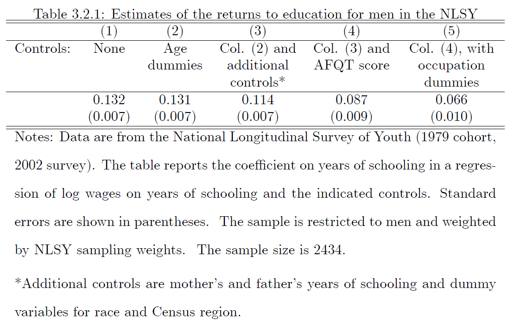

```{r setup, include=FALSE}
knitr::opts_chunk$set(echo = TRUE)
```

********************************************************************************


# **[30 Points]** Final Grade Calculator
********************************************************************************


This section will teach you how to estimate your final grade based upon
assignment performance and potential extra credit.

## **[5 Points]** Markdown Tables
********************************************************************************

Recreate the assignment breakdown table from the syllabus. Replace the R Logo
with a capital R.

*Note: You can neither add a top or bottom line in the Markdown table nor adjust line thickness.*

--Your Table Here--


## **[25 Points]** Final Grade Calculation
********************************************************************************

All estimating your final grade requires is calculating a weighted average.

$$ \text{Final Grade} = \frac{1}{\sum_{a=1}^n \text{weight}_a}\sum_{a = 1}^n \text{weight}_a \text{grade}_a + \text{extra credit}$$

**[5 Points]** Create one object per assignment weight including the Piazza extra credit assignment
and the recording reminder extra credit assignment.

*Hint: write out the math by hand first for each question in this section. The extra credit makes the solutions non-trivial.*


```{r creating weights}

```


Suppose you get the following df_grades on your assignments:

- HW0: 100/100
- HW1: 39/46
- HW2: 73/80
- HW3: 16743/18110
- HW4: 9/11
- Exam 1: 18/23
- Exam 2: 2/2
- Final Project: 89/100
- Piazza: 2 endorsed answers
- Recording Reminder: zero

**[5 Points]** Create an object for each assignment and then print your hypothetical final grade.


```{r final grade calculation}

```

Suppose it is near the end of the semester, and the only assignment we haven't done is the final project but you still have the same amount of extra credit. 

**[4 Points]** What percentage of points **currently available** have you received so far (i.e. excluding the final project)?

```{r so far}

```
**[4 Points]** What percentage of **all points possible** have you received so far?

```{r so far all}

```

**[7 Points]** Is it possible to bump you grade to the next letter (e.g. C to C+)?
If so, what is the minimum score you need on the final project?


```{r bump grade}

```


# **[10 Points]** $\LaTeX$ Math
********************************************************************************

Reproduce the math in the file `elasticities.pdf`

$$Math$$


# **[30 Points]** Bayes Theorem
********************************************************************************

**DISCLAIMER:** FOLLOW ALL CDC AND UNIVERSITY COVID POLICIES AND GUIDELINES. COVID IS CONTAGIOUS BEFORE YOU ARE SYMPOTMATIC ([Walsh et al., 2020](https://www.ncbi.nlm.nih.gov/pmc/articles/PMC7323671/)). You can have COVID before you test positive.

The numbers below are from March 2021.

*************

We are interested in evaluating the probability of having COVID at UIUC given that your receive a positive test.

Our university uses a pooled nucleic acid amplication test (NAAT) according to [McKinely Health Center](https://www.mckinley.illinois.edu/travel-testing-covid-19#:~:text=The%20campus%2Dbased%20saliva%20test,in%20less%20than%2024%20hours.&text=Nasal%20testing%20is%20available%20within,campus%20(M%2DF)%20at%20CRCE.).
These tests have a sensitivity of ~85% and a specificity of ~99% according to [Butler-Laporte et al. (2021)](https://jamanetwork.com/journals/jamainternalmedicine/fullarticle/2775397?guestAccessKey=8058e841-bc18-4398-a251-54087a84297f&utm_source=silverchair&utm_medium=email&utm_campaign=article_alert-jamainternalmedicine&utm_content=olf&utm_term=011521).
Assume that ~50,000 individuals are testing (some students are likely to have not come to campus, however, faculty, administration, and staff must be tested).
Furthermore, assume that 250 of these individuals truly have COVID.

This Bayes table is created using the above numbers with some rounding:

|               | Negative (neg) | Positive (pos) | Total     |
|---------------|----------------|----------------|-----------|
| No COVID (NC) | 49250          | 500            | **49750** |
| COVID (C)     | 38             | 212            | **250**   |
|               |                |                |           |
| **Total**     | **49288**      | **712**        | **50000** |


We are firstly interested in the question: Given that an individual has tested positive, what is the probability they have COVID? Recall Bayes theorem is given by:
$$
\begin{align*}
    p(C|pos) & = \frac{P(pos|C)P(C)}{P(pos)}\\
    & = \frac{P(pos|C)P(C)}{P(pos|C)P(C) + P(pos|NC)P(NC)}
\end{align*}
$$

## **[8 Points]** Bayes Theorem 
********************************************************************************

Using either $\LaTeX$ or R, verify $p(C|pos) = \frac{P(pos|C)P(C)}{P(pos)}$ using the numbers from the table above. If you choose to use LaTeX, print out the answer for fun.

*Hint: *$P(neg) = \frac{49288}{50000}$ *and* $p(neg|NC) = \frac{49250}{49750}$.

Solution $\LaTeX$:


```{r bayes1}
# Solution R
```


## **[10 Points]** Bayesian Decomposition
********************************************************************************

Using **either** $\LaTeX$ or R, verify $P(pos) = P(pos|C)P(C) + P(pos|NC)P(NC)$ using the numbers above.


Solution $\LaTeX$


```{r bayes2}
# Solution R
```


## **[12 Points]** Double Positive 
********************************************************************************

Using R, calculate $P(NC|2pos)$.

*Hints:*

- *You cannot directly evaluate this value from the Bayes table. You need the extended Bayesian decomposition*
- $P(2pos) \neq P(pos)^2$
- $P(2pos|NC) = P(pos|NC)^2$
- *Use LaTeX to write out the equations before estimating (NOT REQUIRED)*
    - *At least do it on paper first*


```{r bayes3}
# Solution R
```


# **[30 Points]** Ordinary Least Squares
********************************************************************************

Estimating the effect of education on wages is particularly challenging because of omitted variable bias (OVB).
We typically think that

$$\text{wage} = f(\text{education}, \text{experience}, \text{background}, \text{genetics}, \text{ability})$$

We are going to illustrate an example of OVB by replicating the values from table 3.2.1 from Mostly Harmless Economics (MHE) (as best we can, i.e. the numbers won't match) using data [National Survey of Youth](https://www.nlsinfo.org/investigator/pages/login).




## **[10 Points]** Cleaning the NLSY Data
********************************************************************************

We are ultimately interested in estimating the regression:

$$log(wage_i) = \alpha + \delta yos_i + \beta_m Myos_i + \beta_f Fyos_i + \beta_a AFQT_i + \gamma_{age} + \gamma{race} + \gamma_{region} + \gamma_{occ} + \epsilon_i $$
where $yos_i$ is years of schooling, $Myos_i$ and $Fyos_i$ are mother's and father's years of schooling respectively, $AFQT_i$ is the Armed Forces Qualification Test (0 - 100,000), and the $\gamma$ variables represent dummy variables.


Before we can work with the data, we need to clean it. 
We need to adjust the years of schooling variables from `character`s to `numeric`s, create the dummy variables, and condition on being male. 

1. **[1 Point]** Read in the data
2. **[4 Points]** Create a mapping of years of schooling variables values to numbers (0 to 20)
  - Recommendation: print the unique years of schooling variables by concatenating the three variables inside of the `unique()` function
  - create an object named `label` that is a concatenation of the unique values
  - create another object named `value` such that the position of the names in `label` corresponds to the respective numeric value for years of schooling
  - create a `data.frame()` called `mapping` using the vectors `label` and `value`
3. **[5 Points]** Create a cleaned data frame called `df` using the package `tidyverse`. Chain the following functions with `%>%`
  - `filter()` for males `&` positive wages (`Q13.5_TRUNC_2002`)
  - `left_join()` with `mapping` using `by = c("mother years of schooling variable = label)`  
  - `rename()` the variable `value` to `mother_yos` (*hint:* `?rename`)
  - perform the above two steps again to create the father variable `father_yos` and the individual variable `yos`
  - using `mutate()`, create the dummy variables `age`, `race`, and `occ` by using `as.factor()` on the respective variables in the data set
  - in the same `mutate()` function, also rescale the AFQT variable to be from 0 to 100
  - remove any rows that have variable with missing values using `na.omit()`


```{r cleaning}

```

## **[2.5 Points]** Regressions
********************************************************************************

Create five objects named `fit1`, `fit2`, ..., `fit5` that correspond to the five columns in MHE Table 3.2.1 using the function `lm()` and the `weights` argument of `lm()`.

*Hint: the coefficient on* `yos` *in the fourth regression should be 0.100*.

```{r regrssions}


```

## **[5 Points]** Frisch-Waugh-Lovell Plot
********************************************************************************

From the fourth regression

1. run another regression to obtain $\tilde{x}_{yos}$. Create a new variable in `df` using $\tilde{x}_{yos}$
2. plot $\tilde{x}_{yos}$ vs `log(wages)` using a scatter plot (`geom_point()`) with a best fit `lm` line (`geom_smooth()`) via `ggplot2`
3. label the x-axis
4. label the y-axis
5. provide a title

```{r fwl}

```

## **[12.5 Points]** Stargazer Table
********************************************************************************

**[10 Points]** Using the `stargazer()` function, create a table over all five regressions and specify

- `type` to text
- `keep` the three years of schooling variables and rescaled AFQT score
- rename the kept variables with `covariate.labels`
- rename the dependent variable with `dep.var.label`
- `omit` the F-statistic, residual standard error, and adjusted R-squared
- using a `list()` of concatenated vectors for each row via `add.lines`:
  - add a line for each of the four dummy variables indicating whether or not they are present with "Yes" or "No" with appropriate row labels
- change the `star.chars` to +, \*, \*\*, \*\*\* (without backslashes)
- change the `star.cutoffs` to 0.1, 0.05, 0.01, 0.001 to match the output of R
- change the `notes` to `c("+ p<0.1; * p<0.05; ** p<0.01; *** p<0.001")`
- set `notes.append` to `FALSE`


```{r stargazer}

```

**[2.5 Points]** The occupation variable is a bad control. Why?

--Your answer here--


